# Machine Learning — 113-2 (Spring 2025)

Coursework repository for the graduate *Machine Learning* course. It contains three
programming assignments and one final project, spanning the classical-to-modern arc of
supervised learning: **closed-form Bayesian regression → gradient-based linear
classifiers written from scratch → a convolutional network trained end-to-end →
transfer learning and ensembling under a 300-image budget.**

Each assignment is self-contained (code, data loaders, produced predictions, and a
written report). This document is the technical index: what the problem was, how it was
formulated, what was searched, what came out, and where the result is fragile.

---

## Results at a glance

| # | Task | Data | Model / estimator | Metric | Result |
|---|------|------|-------------------|--------|--------|
| [HW1](#hw1--regression-with-gaussian-basis-functions-mle--map--bayesian) | 2-D scalar regression | 6,000 train / 1,000 test points | Gaussian-basis linear model | Test MSE | **243.41** (MAP) · 274.56 (Bayesian) · 286.12 (MLE) |
| [HW2](#hw2--logistic-and-softmax-regression-from-scratch) | Digit parity + digit ID | 10,000 train / 2,000 test images (28×28) | Logistic / softmax regression, NumPy only | 5-fold CV accuracy | Selected by grid search over `lr × λ`; no train/val gap observed |
| [HW3](#hw3--facial-expression-recognition-with-a-vgg-style-cnn) | Facial expression recognition (7 classes) | 28,709 train images (48×48 grayscale) | VGG-style CNN, 4.75 M params | Accuracy | **71.55 %** validation · 68 % on the 100-image held-out test set |
| [Final](#final-project--few-shot-food-classification-with-clip--convnext) | Food classification (30 classes) | **300** train / 1,500 test images | CLIP ViT-B/32 + ConvNeXt-Tiny weighted ensemble | Validation accuracy | **88.33 %** (vs. 85.00 % CLIP alone, 73.33 % ConvNeXt alone) |

Reports (`report.pdf` in each folder) contain the derivations and the original
experiment logs; the assignment specifications are the `ML_hw*.pdf` / `ML_Final.pdf`
files.

---

## Repository layout

```
2025_ML/
├── hw1/                       # Gaussian-basis regression: MLE / MAP / Bayesian
│   ├── problem_1.py           #   maximum likelihood (pseudo-inverse)
│   ├── problem_2.py           #   MAP / ridge-regularised least squares
│   ├── problem_3.py           #   Bayesian linear regression (posterior mean)
│   ├── inputs/                #   training_dataset.csv, (additional_small)testing_dataset.csv
│   ├── outputs/               #   result_{1,2,3}.csv  (predictions | weights)
│   └── report.pdf
├── hw2/                       # Linear classifiers implemented in NumPy
│   ├── problem_1.py           #   binary logistic regression (parity of the digit)
│   ├── problem_2.py           #   multinomial (softmax) regression, 10 classes
│   ├── loss_curve*.png        #   training / validation loss curves
│   ├── outputs/               #   result_{1,2}.csv  (2,000 test predictions each)
│   └── report.pdf
├── hw3/                       # Facial expression recognition (FER-2013 style)
│   ├── src/
│   │   ├── data_preprocess.py #   class-count analysis + offline augmentation → balanced_data.csv
│   │   ├── dataset.py         #   Dataset + stratified-free random 80/20 split
│   │   ├── model.py           #   ImprovedCNN (VGG-style, 4 conv blocks + GAP head)
│   │   ├── trainer.py         #   cost-sensitive training loop, early stopping, plots
│   │   └── optimize.py        #   Bayesian hyper-parameter search (skopt gp_minimize)
│   ├── predict.py             #   model.pth + test dir → output.csv
│   ├── evaluate.py            #   output.csv + ans.csv → accuracy / report / confusion
│   └── report.pdf
├── final_project/             # Few-shot (10 images/class) food classification
│   ├── train.ipynb            #   two-stage protocol: model selection → full-data refit
│   ├── predict.ipynb          #   inference → outputs.csv
│   ├── model_info.json        #   selected method, weights, per-method accuracies
│   └── 機器學習期末報告.pdf     #   slide deck
└── assets/                    # figures used by this README
```

> **Data note.** `hw2/{train,test}`, `hw3/{train,test}`, `hw3/src/augmented`,
> `hw3/src/balanced_data.csv`, and `final_project/{train,test_data}` are listed in
> [.gitignore](.gitignore), as are `*.pth` checkpoints — the image corpora, the ~21 k
> generated augmentation images, and the trained weights live locally, not in the
> repository. Every script assumes it is run from the folder shown in the commands below.

### Environment

| Assignment | Requirements |
|---|---|
| HW1 | `numpy`, `pandas`, `matplotlib` |
| HW2 | `numpy`, `pillow`, `matplotlib`, `tqdm` |
| HW3 | `torch`, `torchvision`, `torchsummary`, `opencv-python`, `scikit-learn`, `scikit-optimize`, `pandas`, `tqdm` |
| Final | `torch`, `torchvision`, `open_clip_torch`, `timm`, `torchinfo`, `pillow` (notebooks install missing packages on first run) |

---

## HW1 — Regression with Gaussian basis functions: MLE / MAP / Bayesian

**Task.** Learn $y : [0,1]^2 \rightarrow \mathbb{R}$ from 6,000 noisy samples and predict
on a 1,000-point held-out set. The same linear-in-parameters model is fitted three
times, once per inference principle, so that the three estimators can be compared on
identical features.

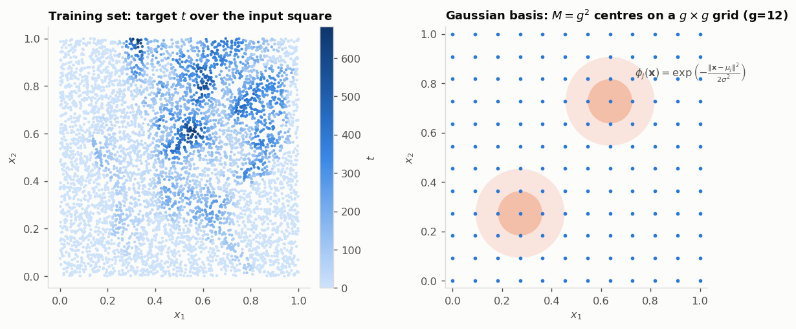

**Model.** The inputs are lifted by $M = g^2$ isotropic Gaussian basis functions whose
centres $\mu_j$ tile a $g \times g$ regular grid on the unit square:

$$\phi_j(\mathbf{x}) = \exp\!\left(-\frac{\lVert \mathbf{x} - \mu_j \rVert^2}{2\sigma^2}\right),
\qquad y(\mathbf{x}) = \mathbf{w}^\top \boldsymbol{\phi}(\mathbf{x}).$$

$g$ controls capacity ($M$ grows quadratically) and $\sigma$ controls how many bases a
point activates — small $\sigma$ with large $g$ over-fits, the reverse under-fits. Both
are chosen by exhaustive search rather than by gradient descent.

| Script | Estimator | Closed form | Search space |
|---|---|---|---|
| [problem_1.py](hw1/problem_1.py) | Maximum likelihood | $\mathbf{w} = (\Phi^\top\Phi)^{+}\Phi^\top \mathbf{t}$ | $g \in [6,49]$, $\sigma \in [0.03, 0.2]$ (8 steps) |
| [problem_2.py](hw1/problem_2.py) | MAP / ridge | $\mathbf{w} = (\Phi^\top\Phi + \lambda I)^{-1}\Phi^\top \mathbf{t}$ | above $\times$ $\lambda = 10^{-8} \dots 10^{2}$ |
| [problem_3.py](hw1/problem_3.py) | Bayesian | $S_N^{-1} = \alpha I + \beta \Phi^\top\Phi$, $\ \mathbf{m}_N = \beta S_N \Phi^\top \mathbf{t}$ | $g \in [6,39]$, $\sigma$ (5 steps), $\alpha \in \{0.1,1,10\}$, $\beta \in \{10,50,100\}$ |

The three estimators are the same objective seen through different lenses: MLE
minimises $\sum_n (t_n - \mathbf{w}^\top\boldsymbol{\phi}(\mathbf{x}_n))^2$; MAP adds
$-\log p(\mathbf{w})$ with $p(\mathbf{w}) = \mathcal{N}(\mathbf{0}, \alpha^{-1}I)$, which
*is* the ridge penalty; the Bayesian version keeps the full posterior
$\mathcal{N}(\mathbf{m}_N, S_N)$ and reports its mean. Predictions are clipped at zero,
since the target is non-negative.

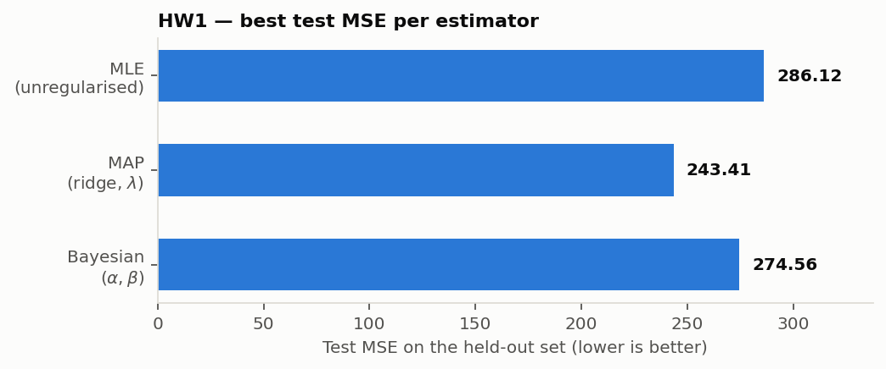

**Findings.** The unregularised fit is best at $g = 36$, $\sigma = 0.030$ (1,296 basis
functions) with MSE 286.12; adding the Gaussian prior buys a **15 % error reduction**
(243.41). This is the expected regime: with $M$ on the order of $10^3$ and strongly
localised bases, $\Phi^\top\Phi$ is badly conditioned and the penalty does real work.
The Bayesian posterior mean lands between the two — the $(\alpha, \beta)$ grid is
coarser than the $\lambda$ grid, so the gap is a search-budget artefact rather than
evidence that MAP dominates.

```bash
cd hw1 && python problem_1.py    # writes outputs/result_1.csv and problem_1.png
```

**Caveat worth stating.** Hyper-parameters are selected against the same held-out file
that is used to report MSE, so the reported numbers are *selection-optimistic*. A clean
protocol would split the 6,000 training points into train/validation and touch the test
file once.

---

## HW2 — Logistic and softmax regression from scratch

**Task.** Two classification problems over the same 10,000 handwritten digits
(1,000 per class, 28×28 grayscale), predicting 2,000 unlabeled test images. **No ML
library is used** — forward pass, gradients, regularisation, and cross-validation are
all written directly in NumPy.

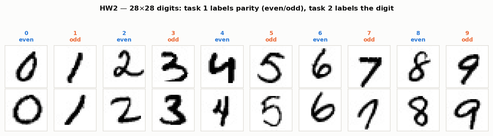

| | [problem_1.py](hw2/problem_1.py) | [problem_2.py](hw2/problem_2.py) |
|---|---|---|
| Label | parity, $t = d \bmod 2$ | digit identity, $t \in \{0,\dots,9\}$ |
| Link | sigmoid $\sigma(z)$ | softmax (max-subtracted for stability) |
| Loss | binary cross-entropy + $\tfrac{\lambda}{2}\lVert W\rVert^2$ | categorical cross-entropy + $\tfrac{\lambda}{2}\lVert W\rVert^2$ |
| Parameters | $W \in \mathbb{R}^{784 \times 1}$, $b$ | $W \in \mathbb{R}^{784 \times 10}$, $b \in \mathbb{R}^{10}$ |
| Grid searched | `lr ∈ {0.55…0.59} × λ ∈ {1e-5…1e-2}` | `lr ∈ {0.50…0.60} × λ ∈ {1e-5…1e-2}` |

Both losses come from the same place — the negative log-likelihood of the label
distribution — and both collapse to the same gradient shape, which is why the second
program is the first with `sigmoid` swapped for `softmax`:

$$\frac{\partial \mathcal{L}}{\partial W} = \frac{1}{N}X^\top(\hat{Y} - Y) + \lambda W,
\qquad \frac{\partial \mathcal{L}}{\partial b} = \frac{1}{N}\sum_n (\hat{y}_n - y_n).$$

**Protocol.** Pixels are scaled to $[0,1]$, the training set is shuffled once, and every
$(\text{lr}, \lambda)$ pair is scored by hand-rolled **5-fold cross-validation**
(1,000 full-batch gradient steps per fold). The winning pair is refit on all 10,000
images to produce the submitted predictions, and refit a second time with an explicit
80/20 split purely to plot the generalisation gap.

<p align="center">
  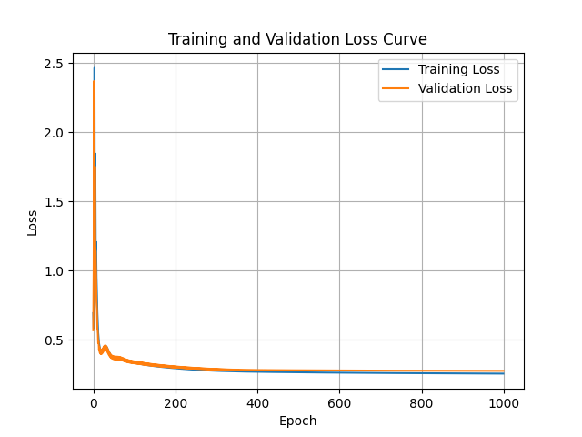
  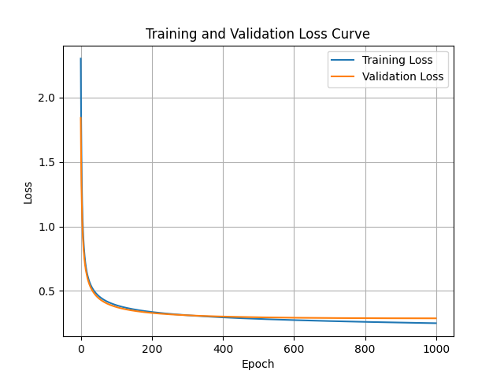
</p>

**Findings.** Both curves decrease monotonically and the validation trace tracks the
training trace to the last epoch — with a linear model, 784 features, and L2, there is
no capacity left to over-fit 10,000 examples, so early stopping is unnecessary here. The
report also documents an exponential learning-rate-decay experiment whose loss curve
oscillates violently before converging around epoch 600: a useful negative result about
schedules interacting badly with full-batch descent at $\text{lr} \approx 0.5$.

```bash
cd hw2 && python problem_1.py    # → outputs/result_1.csv, loss_curve_1.png, loss_curve1_with_val.png
cd hw2 && python problem_2.py    # → outputs/result_2.csv, loss_curve_2.png, loss_curve2_with_val.png
```

*Cost note:* cross-validation retrains from scratch for every fold and every grid point
(20 configurations × 5 folds × 1,000 epochs on a dense 10,000×784 matrix), which
dominates runtime.

---

## HW3 — Facial expression recognition with a VGG-style CNN

**Task.** Seven-way facial-expression classification from 48×48 grayscale faces
(28,709 training images), scored on a 100-image held-out set. This is the first
assignment where the interesting problem is not the model but the **label distribution**.

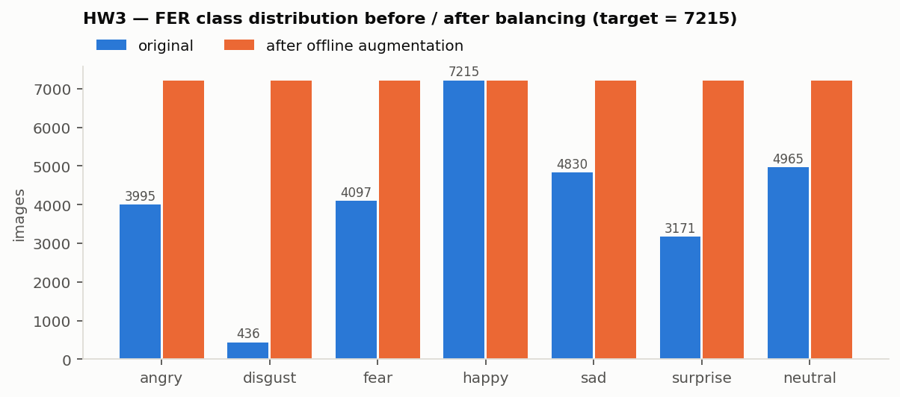

`disgust` is 17× rarer than `happy`. Two independent corrections are applied:

1. **Data level** — [data_preprocess.py](hw3/src/data_preprocess.py) oversamples every
   minority class up to the majority count (7,215) by cycling horizontal flip, vertical
   flip, and a random rotation of $\pm 30^\circ$, writing the synthetic images to disk and
   recording all 50,505 paths in `balanced_data.csv`.
2. **Loss level** — [trainer.py](hw3/src/trainer.py) additionally applies
   **cost-sensitive** class weights in the cross-entropy, boosting the two classes that
   remained weakest after balancing (`fear` → 1.573, `sad` → 1.496).

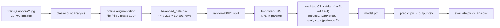

**Architecture** ([model.py](hw3/src/model.py)). Four VGG-style blocks
(`Conv3×3 → BN → ReLU → Conv3×3 → BN → ReLU → MaxPool → Dropout 0.25`) with widths
64 → 128 → 256 → 512, then **global average pooling** instead of a flatten, then
`Linear(512,128) → ReLU → Dropout 0.5 → Linear(128,7)`.

| | value |
|---|---|
| Input / output | $1 \times 48 \times 48$ → 7 logits |
| Spatial path | 48 → 24 → 12 → 6 → 3 → GAP |
| Parameters | 4,754,631 (18.1 MB weights, 31.87 MB total footprint) |
| Optimiser | Adam, lr $10^{-3}$, weight decay $10^{-4}$, batch 64, ≤50 epochs |
| Regularisation | BatchNorm, dropout (0.25 conv / 0.5 head), GAP, early stopping |

GAP is the deliberate choice here: it removes the $3\!\times\!3\!\times\!512 \to 128$
dense layer that would otherwise hold most of the parameters, which is what keeps the
model at 4.75 M and trainable on a Colab GPU. A plain CNN (~2 M) served as the baseline
and a from-scratch ResNet-18 (~5.3 M) was also implemented; the VGG-style variant
generalised best and was carried forward.

Hyper-parameters were additionally tuned with **Bayesian optimisation**
([optimize.py](hw3/src/optimize.py), `gp_minimize`, 20 calls over learning rate, batch
size, and weight decay, minimising validation loss).

**Results.** 71.55 % accuracy on the 10,101-image validation split (macro-F1 0.7107);
`disgust` is essentially solved after balancing (F1 0.964) while `fear` (0.530) and
`sad` (0.556) stay hardest — the two classes that motivated the cost-sensitive weights
in the first place. On the graded 100-image test set:

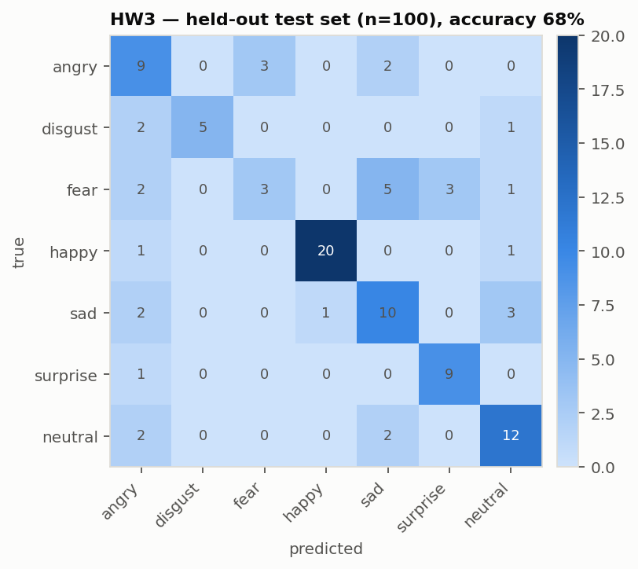

The residual error structure is the one every FER system shows: `fear` leaks into `sad`
and `angry`, `neutral` into `sad`. These are genuinely overlapping in low-resolution
frontal faces, and no amount of resampling fixes them — the honest next step is a
higher-capacity backbone or landmark/attention supervision, not more augmentation.

```bash
cd hw3/src && python data_preprocess.py && python trainer.py
cd hw3     && python predict.py model.pth test/ output.csv
cd hw3     && python evaluate.py output.csv ans.csv
```

**Known rough edges.** Vertical flip is a questionable augmentation for faces (an
upside-down face is off-manifold for the test distribution); `optimize.py` imports
`train` from a module named `train` while the loop now lives in `trainer.py`, so the
search script needs that import fixed before it will run; and the 80/20 split is drawn
*after* augmentation, so augmented copies of a training face can land in validation —
which inflates the 71.55 % figure relative to the 68 % measured on the clean test set.

---

## Final project — Few-shot food classification with CLIP + ConvNeXt

**Task.** Classify 30 food categories from **10 labelled images per class** (300 total),
predicting a 1,500-image test set, under a hard constraint of **< 1000 M parameters** and
PyTorch only. At 10 examples per class, training a network from scratch is hopeless; the
entire problem is how much prior knowledge can be imported and how little of it should
be disturbed.

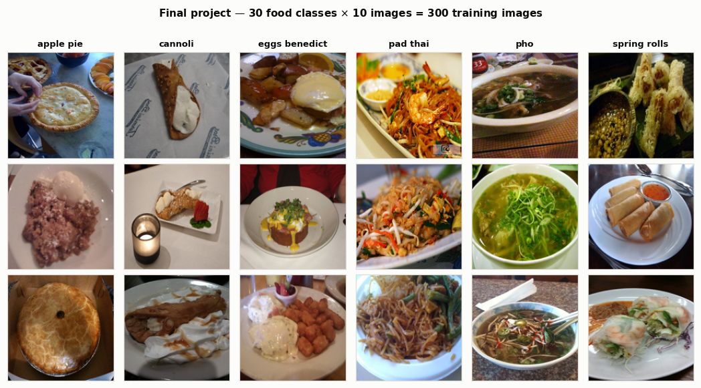

**Two backbones, both mostly frozen.**

| Method | Backbone | What is trained | Val. accuracy |
|---|---|---|---|
| CLIP fine-tuning | `ViT-B-32`, `laion2b_s34b_b79k` (open_clip) | `ln_post`, `proj`, + a linear head on the 512-d image embedding | 85.00 % |
| Standard timm | `convnext_tiny` (ImageNet) | classifier head only | 73.33 % |
| **Optimised ensemble** | both | weighted average of the two softmax outputs | **88.33 %** |

CLIP wins by a wide margin because its contrastive image–text pre-training on
web-scale data yields features that already separate food categories almost linearly —
exactly the "semantic relatedness between the pre-training task and the target task"
condition the report identifies as the precondition for transfer to work.

**Ensemble weights are searched, not assumed.** Both models' softmax outputs are
collected on the validation split and a grid over $w_1 \in \{0.1,\dots,0.9\}$,
$w_2 = 1 - w_1$ is scored directly for accuracy; the selected combination is
$0.9 \times \text{CLIP} + 0.1 \times \text{ConvNeXt}$, i.e. ConvNeXt acts as a small
corrective term rather than an equal partner, and still adds **+3.33 pp** over CLIP alone.

**Two-stage training protocol** ([train.ipynb](final_project/train.ipynb)):

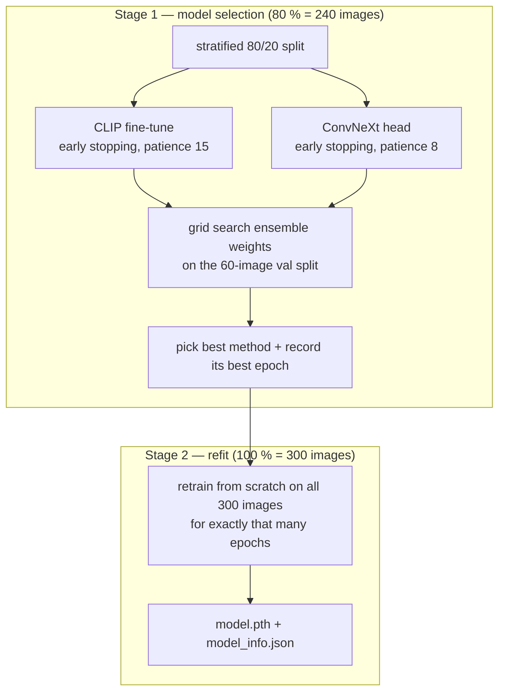

Stage 2 implements the standard "use the validation set to pick the *number of epochs*,
then spend the validation data on training" argument: early stopping decides
when to stop (49 epochs for CLIP, 24 for ConvNeXt), and the final model is refit on all
300 images for that fixed budget with no validation set at all. Augmentation is
`RandomResizedCrop(0.8–1.0)`, horizontal flip, and colour jitter; evaluation uses
resize-256 + centre-crop-224 with ImageNet normalisation.

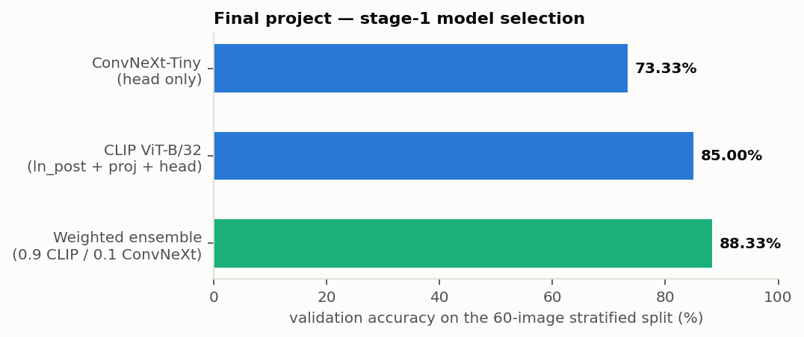

**Findings and limits.**

- Fine-tuning only `ln_post`/`proj` plus a linear head keeps trainable parameters in the
  hundred-thousand range — with 240 training images, any larger trainable surface
  over-fits before it generalises.
- A separate experiment with heavier data augmentation *raised* CLIP alone to 86.67 %
  but *lowered* the ensemble to 85.00 %: stronger augmentation reduced the diversity
  between the two models, and diversity is what the ensemble is monetising.
- **The headline number rests on 60 validation images.** One image is 1.67 pp, so the
  88.33 % vs. 85.00 % gap is roughly two images. The ensemble weights were also chosen on
  that same 60-image split, so the selected 0.9/0.1 split is fit to a very small sample.
  Repeated stratified splits or leave-one-out over the 300 images would give a far more
  trustworthy estimate, and `test_data/golden.csv` (1,500 labels) is the set that should
  carry the final claim.

Run [train.ipynb](final_project/train.ipynb) (expects the data at `/content/train`, i.e.
Colab), then [predict.ipynb](final_project/predict.ipynb), which reads
`model_info.json`, rebuilds the selected architecture, and writes `outputs.csv` sorted by
image number.

---

## Threads that run through the four assignments

1. **Regularisation is the same idea in four costumes.** The Gaussian prior in HW1, the
   L2 penalty in HW2, dropout/BatchNorm/GAP/early stopping in HW3, and freezing almost
   all of CLIP in the final project are all statements of the same trade: constrain the
   hypothesis space in proportion to how little data there is.
2. **The data distribution decides the method.** HW3's gains came from class balancing
   and cost-sensitive weights, not from a fancier network; the final project's came from
   choosing *which* pre-trained features to import.
3. **Model selection needs its own honest split.** HW1 selects against the reported test
   file, HW3 splits after augmentation, and the final project selects ensemble weights on
   60 images. Each is documented above; each is the first thing to fix if these
   experiments were to be written up as research rather than coursework.

## References

- Radford et al., *Learning Transferable Visual Models From Natural Language Supervision* (CLIP) — <https://arxiv.org/abs/2103.00020>
- Liu et al., *A ConvNet for the 2020s* (ConvNeXt) — <https://arxiv.org/abs/2201.03545>
- Bishop, *Pattern Recognition and Machine Learning*, ch. 3 (linear regression, evidence framework) and ch. 4 (logistic/softmax regression)
